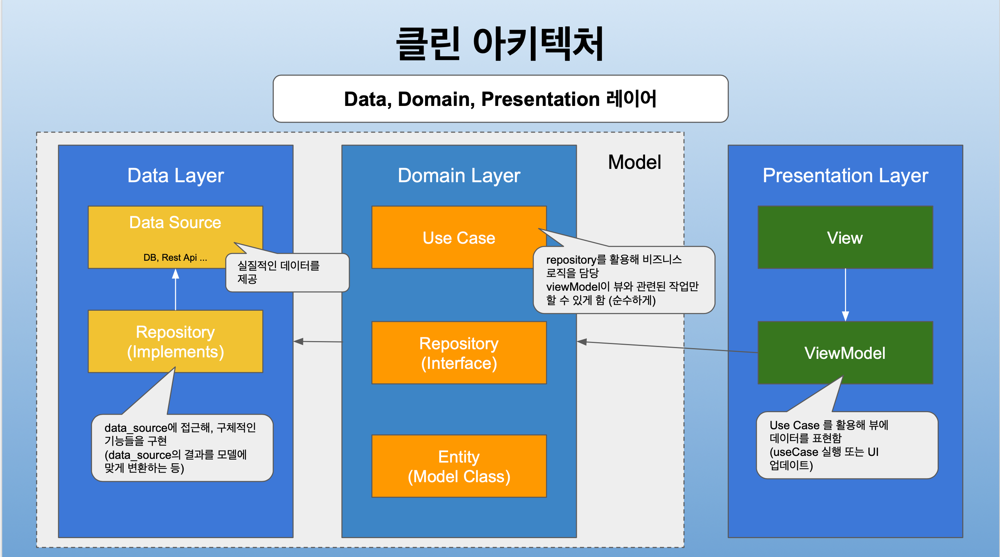

- 오준석님의 "Flutter 중급 - 클린 아키텍처" 강의 내용을 인용하여 작성합니다.
- [강의 링크](https://www.inflearn.com/course/플러터-중급)

- 사람마다 프로젝트를 설계하는 방식에 차이는 있겠지만, 최근 Flutter로 프로젝트를 수행해보면서 위와 같은 MVVM 모델의 구조가 앱 개발을 위한 프로젝트 구조에 있어서 나름 괜찮다고 생각합니다.

### 노트 앱 예제 프로젝트 구조
/lib 아래에서 코드 작성

#### entity(data) layer
- /lib/data/data_source: 로컬 DB와 접근
- /lib/data/repository: domain layer의 repository를 구현

> data_source 영역에 로컬 DB나 서버 API 등 데이터 제공자가 되는 영역을 구현하면 되겠습니다.
> 
> domain layer에서 추상적으로 작성되어 있는 코드들을 구체적으로 구현해야 합니다. 

#### domain layer
- /lib/domain/model: 데이터 모델
- /lib/domain/repository: 기능 선언
- /lib/domain/use_case: 비즈니스 로직 구현부

> 구현에 대한 상세 내용을 data layer에서 가져오면 use_case 영역에서 해당 기능별 비즈니스 로직을 작성합니다.

#### presentation layer
- /lib/presentation/notes: 노트 화면
- /lib/presentation/add_edit_note: 추가 화면

> ViewModel: UI에 표현될 데이터들을 use_case를 통해 가져와 화면에 데이터를 표현할 수 있도록 도와줍니다.
> use_case에서 딱히 처리하는 로직이 영원히 없을거라면 domain layer의 repository를 바로 참조하는 것도 괜찮습니다. 
> **처음 프로젝트 할 때에는 use_case를 만들지 않고 호출해보다가 ViewModel에 구현되어 있는 비즈니스 로직이 보이면 그 때 리팩토링 하면 되겠습니다.**
>
> View: 데이터를 처리해야 할 로직이 있다면 ViewModel에게 요청합니다.

#### 기타
- /lib/core: 프로젝트 전역에서 사용할 공용 함수 정의
  - logging이나 원하는 Time String을 만들어주는 함수 등 필요한 공용 함수를 작성하면 되겠습니다.
- /lib/ui: UI에서 공통으로 쓰일 위젯들 정의
  - 공통으로 사용할 dialog, button, text의 디자인적인 부분을 정의하면 좋을 것 같습니다.
- /lib/di: 의존성 주입 관리
  - GetX, provider 등을 사용할 때 유용했습니다.
