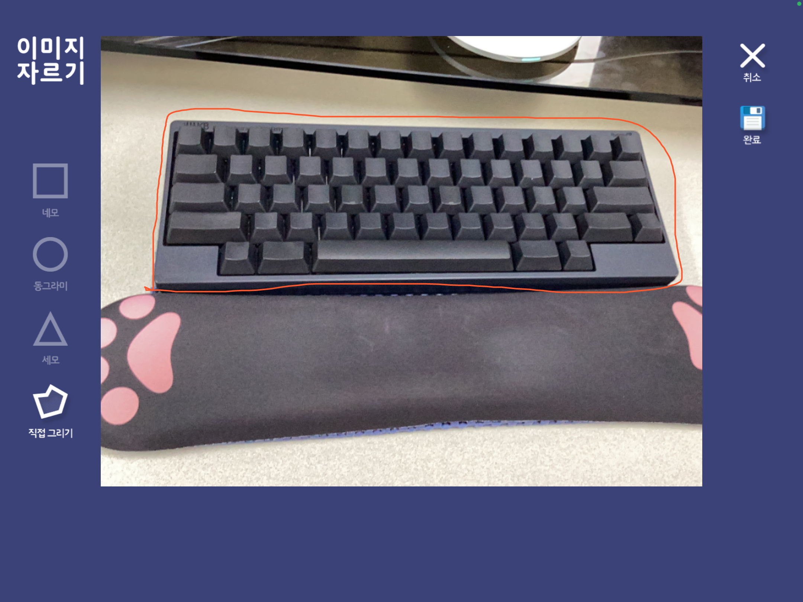
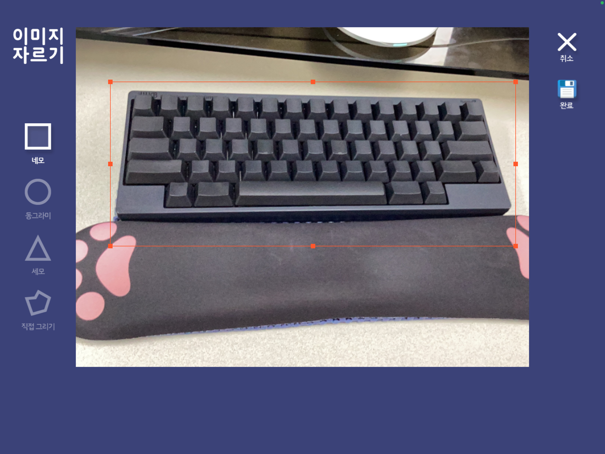

# 13기 1주차 강민

[boring-km - Overview](https://github.com/boring-km)

## 하는 일

유아/초등용 태블릿 앱을 Flutter와 Android Native로 개발하고 있는 진강민입니다.

일 시작한지는 3년 정도 되었습니다.. (전에는 서버 개발자였어요)

## Flutter

Flutter를 처음 접한 시기는 2020년 12월입니다. 원래 Android 개발은 할 줄 알고 있는 상태에서 갖고 있던 맥북을 좀더 적극적으로 활용해보려고 iOS 개발도 해보려다가 크로스플랫폼 개발이 개인 프로젝트 개발 시 생산성이 더 뛰어날 것 같아 선택했습니다.

작년 여름까지는 거의 회사에서만 사용하거나 개인 프로젝트로만 작업을 해보다가 작년 8월부터 사이드 프로젝트를 팀 단위로 진행하면서 조금 더 알아가려고 하는 단계에 있습니다.

## 스터디 지원 동기

Flutter를 좀 더 지혜롭게 사용하는 방법들을 공유하고, 공유 받고 싶어서 지원했어요 🙂

아직 경험도 적고 이런 방식으로 스터디 진행하는게 처음이라 어색한 것도 많지만 잘 부탁드려요 ㅎㅎ

## 발표 진행 방식

Notion 이나 Velog를 통해 어느정도 정리된 진행상황 공유하고,

소스코드를 보여드릴 땐 IntelliJ IDEA에서 작성한 형태로 보여드릴 것 같습니다.

(추가) 진행하면서 생긴 질문들, 주간 회고

## 진행할 프로젝트

| Week 1 | 프로젝트 및 자기 소개 |
| --- | --- |
| Week 2 | 프로필 소개 화면 Flutter Web으로 만들어보기 |
| Week 3 | 프로필 소개 화면 Flutter Web으로 만들어보기 |
| Week 4 | 링크풀 테스트 코드 작성 및 리팩토링 |
| Week 5 | 링크풀 테스트 코드 작성 및 리팩토링 |
| Week 6 | 이미지 Custom Crop Plugin 개발 |
| Week 7 | 이미지 Custom Crop Plugin 개발 |
| Week 8 | 이미지 Custom Crop Plugin 개발 |

### 1. 프로필 소개 화면 Flutter Web으로 만들어보기

- 목적: 포트폴리오를 좀 더 세련된(?) 방법으로 표현해보고자 시작해보려고 해요.

개발 전 Markdown Web에서 로딩하는 예제 샘플: [https://github.com/boring-km/flutter_md_viewer](https://github.com/boring-km/flutter_md_viewer)

배포된 테스트 Web 화면: [https://boring-km.github.io/flutter_md_viewer](https://boring-km.github.io/flutter_md_viewer/#/)

### 2. 링크풀 테스트 코드 작성

- 목적: 급하게 개발하면서 놓쳐왔던 테스트 코드를 늦게나마 작성해보면서 테스트 코드 작성에 좀 더 익숙해지고, 가능하다면 CI/CD 파이프라인에 테스트 커버리지까지 반영할 수 있었으면 좋겠습니다. (이건 희망사항이네요 ㅠㅠ)

- PlayStore: [https://play.google.com/store/apps/details?id=com.mr.ac_project_app](https://play.google.com/store/apps/details?id=com.mr.ac_project_app)
- AppStore: [https://apps.apple.com/us/app/링크풀-체계적인-링크-관리의-시작/id1644108674](https://apps.apple.com/us/app/%EB%A7%81%ED%81%AC%ED%92%80-%EC%B2%B4%EA%B3%84%EC%A0%81%EC%9D%B8-%EB%A7%81%ED%81%AC-%EA%B4%80%EB%A6%AC%EC%9D%98-%EC%8B%9C%EC%9E%91/id1644108674)
- Source Code: [https://github.com/Monday-Rocket/ac_project_app](https://github.com/Monday-Rocket/ac_project_app)

### 3. 이미지 Custom Crop Plugin 개발

- 목적: 회사에서 이미지 Crop 기능을 구현하는데 정말 필요로 하는 기능이 없어서 라이브러리로 만들면 좋겠다고 생각했어요
- 현재는 직접 프로젝트 내에 구현된 코드만 존재 → Plugin으로 변환 필요 → [Pub.dev](http://Pub.dev) 업로드 목표
- CustomPaint를 활용해 선택 영역만 Path로 잘라내서 Canvas, PictureRecorder 등을 활용해 이미지 파일로 만든다.
- 정해진 도형 크기를 조절하거나, 직접 선택영역을 그려 그 부분만 Crop 할 수 있도록 한다.

