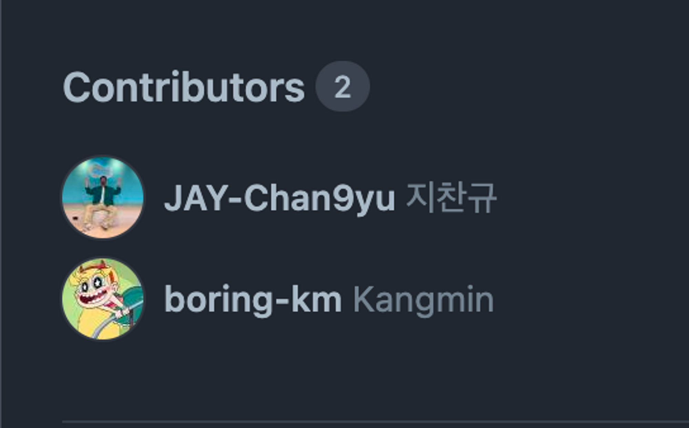

# OPGC 오픈소스 기여하기 성공

- PR: https://github.com/DirtyBoyz/opgc_backend/pull/70
- 어느날부터인가 일일 커밋 표시해주는 뱃지가 맛이 갔길래 코드를 찾아보니 github 잔디 그리는 html 코드에 변경이 생긴걸로 파악됨.
- python으로 구현되어 있는 오픈소스를 발견해서 PR 날려서 약간의 수정 후 반영됨



사소한 흔적을 남기는데에 성공!

# 달력 좌우 스크롤 성공

```kotlin
@Composable
private fun CalendarGrid(
    modifier: Modifier,
    days: MutableList<CalendarDay>,
    spread: MutableState<Boolean>,
    selected: MutableState<CalendarDay>,
    year: Int,
    month: Int,
    calendarMonth: MutableState<Int>,
    onItemSelected: (CalendarDay) -> Unit,
    onPageChanged: (PageChangedState) -> Unit,
) {
    val initialPage = getMonthsPassedSince2023(year, month)
    val pageState = rememberPagerState(pageCount = { 924 }, initialPage = initialPage)
    val currentPage = remember { mutableIntStateOf(initialPage) }

    LaunchedEffect(pageState) {
        snapshotFlow { pageState.currentPage }.collect { page ->
            if (spread.value) {
                if (currentPage.intValue < page) {
                    onPageChanged(PageChangedState.NEXT)
                } else if (currentPage.intValue > page) {
                    onPageChanged(PageChangedState.PREV)
                }
                Log.i("ComposeCalendar", "page: ${page}, currentPage: ${pageState.currentPage}")
                currentPage.intValue = page
            }
        }
    }

    // year와 month가 변경될 때마다 실행되는 LaunchedEffect
    LaunchedEffect(year, month) {
        val newInitialPage = getMonthsPassedSince2023(year, month)
        currentPage.intValue = newInitialPage
        pageState.scrollToPage(newInitialPage)
    }

    HorizontalPager(state = pageState, pageSpacing = 56.dp, verticalAlignment = Alignment.Top, userScrollEnabled = spread.value) { page ->
        LazyVerticalGrid(
            columns = GridCells.Fixed(7),
            contentPadding = PaddingValues(0.dp),
            modifier = Modifier.heightIn(min = 68.dp, max = (68 * 7).dp)
        ) {
            val currentMonth = getMonthFromPage(page)

            if (days.isNotEmpty()) {
                Log.i("ComposeCalendar", "page: ${page}, currentPage: ${currentPage.intValue}, month: $month, currentMonth: $currentMonth, days[15].month: ${days[15].month}")
                val dayList = if (page < currentPage.intValue || currentMonth < days[15].month) getWeekDays(days.first().getPreviousCalendar())
                else if (page == currentPage.intValue && (currentMonth == month) && days[15].month == month) days
                else getWeekDays(days.last().getNextCalendar())

                items(dayList) { date ->
                    AnimatedVisibility(visible = spread.value) {
                        DayOfMonthIcon(date, selected, modifier = modifier) {
                            selected.value = it
                            calendarMonth.value = month
                            onItemSelected(it)
                        }
                    }
                    AnimatedVisibility(visible = !spread.value) {
                        if (date.isSameWeek(selected.value)) {
                            DayOfMonthIcon(date, selected, modifier = modifier) {
                                selected.value = it
                                calendarMonth.value = month
                                onItemSelected(it)
                            }
                        }
                    }
                }
            }
        }
    }
}
```

# 초등학생 과외 시키기 2회차

- [첫번째 시간](https://www.notion.so/d9a64b6738fb4ffb9393e16964673a81?pvs=21)
- [두번째 시간](https://www.notion.so/dc54d195286e4b488351183d1ec0d8b6?pvs=21)
- 나도 만들어볼까

  